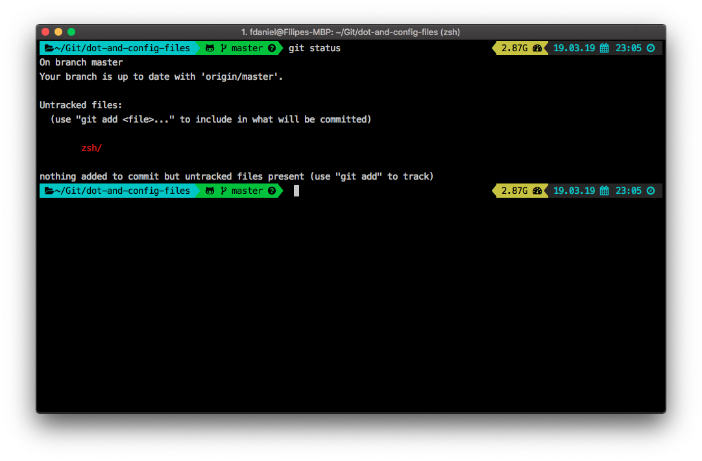

# DotConfig-files

:wrench: Dotfiles, software config files and automated configuration for OSX

---

### Oh My Zsh

*zsh repository folder*

- Pre requeriments:
  - Install zsh and oh-my-zsh: [https://github.com/robbyrussell/oh-my-zsh](https://github.com/robbyrussell/oh-my-zsh)



- Theme: powerlevel9k: [https://github.com/bhilburn/powerlevel9k](https://github.com/bhilburn/powerlevel9k)

- Font: 

  - awesome-fontconfig or nerd-fonts [https://github.com/ryanoasis/nerd-fonts](https://github.com/ryanoasis/nerd-fonts)

- Aliases

  ```bash
  # Navigation
  alias ..="cd .."
  alias ...="cd ../.."
  alias ....="cd ../../.."
  alias .....="cd ../../../.."
  alias -- -="cd -"
  alias home="cd ~"
  
  # Shortcuts
  alias dl="cd ~/Downloads"
  alias dev="cd ~/Development"
  
  alias l="ls"
  alias g="git"
  alias h="history"
  ```

- Functions

  ```bash
  # backup git changes!
  function git-backup() {
       git add --all
       git commit -am 'Done for today!'
       git push $@
  }
  
  # Get a gitignore for a projet technology (parameter)!
  function git-ignore() {
    curl -L -s https://www.gitignore.io/api/$@
  }
  
  # Create a new folder and CD in it!
  function mkcd() {
       mkdir -p $@
       cd $@
  }
  
  # With no arguments opens the current directory, otherwise opens the given location
  function o() {
      if [ $# -eq 0 ]; then
          open .;
      else
          open $@;
      fi;
  }
  ```

- Plugins

  ```bash
  plugins=(colored-man-pages git osx sublime vscode)
  ```

#### Instalation:

- After install oh-my-zsh, replace the content of the *".zshrc"* in the home directory with the content of *"dot.zshrc"*.

- Copy the *"dot.dotfiles"* folder to the home directory and renamed to *".dotfiles"*.

---

### Visual Studio Code

*vscode repository folder*

....

....

---

### Sublime Text

*sublime repository folder*

...

...

---

### Scripts

*scripts repository folder*

...

...
